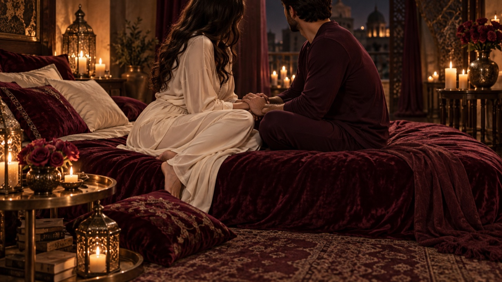
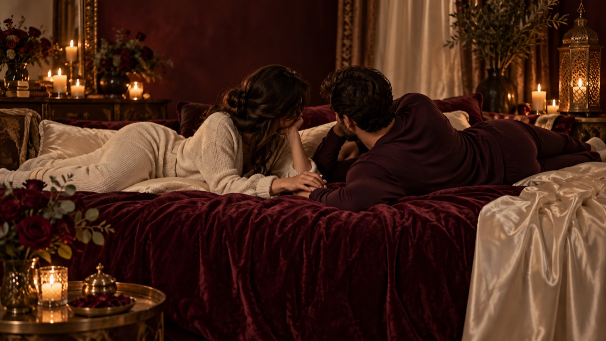
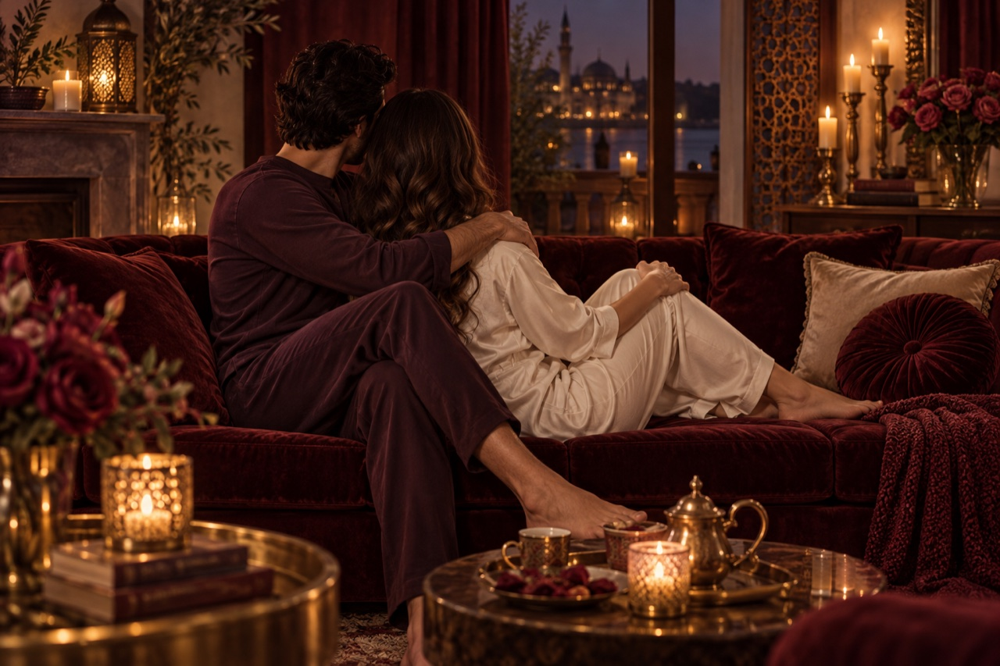
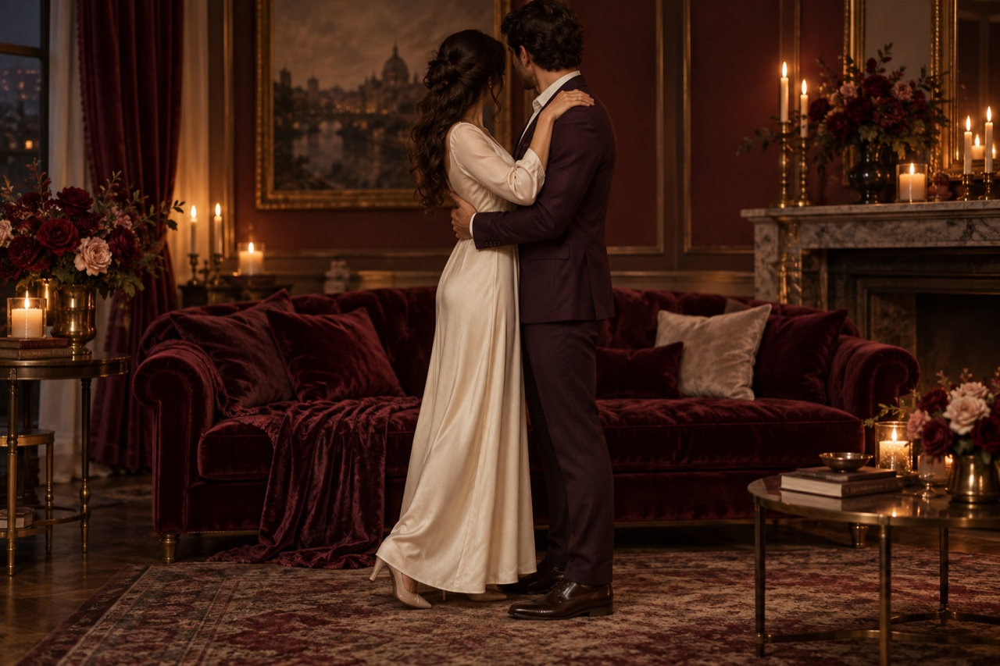

# صور الوضعيات

الملفات الكاملة محفوظة في [`public/images/positions/`](../public/images/positions/). صُنعت بالهوية البصرية للموقع: مخمل عنابي، حرير عاجي، ذهب نحاسي، وضوء دافئ. تظهر بالغين بملابس كاملة ومن دون ملامح وجه واضحة.

## التقابل جلوسًا

## جنبًا إلى جنب

## العناق جلوسًا

## التقارب وقوفًا

تُستخدم هذه الصور مع [دليل الوضعيات](positions.md). لا تصوّر فعلًا جنسيًا أو عريًا.
